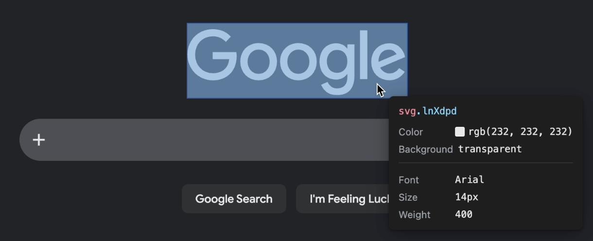
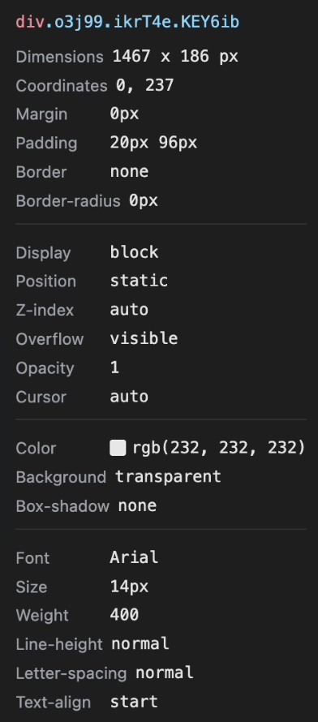

# DOMLens

> Hold a hotkey, hover any element, see what it's made of — and copy it in a format your AI agent can understand.



DOMLens is a **Chrome extension** for developers who work with AI agents. Hold a key, hover an element, and your clipboard gets either a compact HTML snippet or a full structured snapshot — ready to drop straight into an LLM prompt.

It's **not** on the Chrome Web Store yet. Install it manually from this repository in under three minutes.

---

## Installation

DOMLens ships as an **unpacked extension** — no store, no installer.

1. **Download this repository** — click the green `Code` button → `Download ZIP` and unzip it. (Or `git clone` if you prefer.)
2. **Open `chrome://extensions`** in Chrome.
3. **Enable Developer mode** (toggle in the top-right corner).
4. **Click `Load unpacked`** and select the unzipped `domlens/` folder.
5. **Pin DOMLens to the toolbar** — click the puzzle-piece icon and pin DOMLens for one-click access to settings.

The extension works on every site immediately after loading.

> **Chrome Web Store:** _coming soon_

---

## Features

### Hold-to-Inspect

Hold your hotkey (default: **Left Alt**) and move the mouse. A floating info panel follows your cursor and shows the hovered element's properties in real time. Release the key and everything disappears — no persistent devtools panel, no clutter.



### 21 Configurable Info Fields

The panel shows element properties across five categories. Every field can be toggled in the options page.

| Group          | Fields                                                          |
| -------------- | --------------------------------------------------------------- |
| **Text**       | Visible element text (truncated in the panel; shown first)    |
| **Box**        | Dimensions, Coordinates, Margin, Padding, Border, Border-radius |
| **Layout**     | Display, Position, Z-index, Overflow, Opacity, Cursor           |
| **Colors**     | Color (with swatch), Background (with swatch), Box-shadow       |
| **Typography** | Font, Size, Weight, Line-height, Letter-spacing, Text-align     |

Eight fields are on by default (including **Text** at the top of the panel); the rest are one click away.

### Scroll Navigation (optional)

In the options page, enable **Scroll to navigate nested elements**. While Inspect Mode is active, page scrolling is locked and the scroll wheel walks the selection up the **inspect chain** — from the element under your cursor to its parent, grandparent, and so on up to `<body>`. Scroll back down to return toward the leaf. Point at a different element to reset. Off by default.

### CSS Box Model Visualization

Four semi-transparent layers highlight the hovered element's box model:

- **Orange** — margin
- **Yellow** — border
- **Green** — padding
- **Blue** — content

Only non-zero layers are drawn, so you immediately _see_ the spacing instead of mentally piecing it together from numbers.

### Copy to Clipboard — Tap or Hold

While holding the hotkey, press the **action key** (default: **C**) to copy. How long you press determines what you get:

**Tap → Element Snippet** (compact HTML, optionally in a `"""` block)

```html
"""
<button data-testid="submit-btn" class="btn-primary">Submit form</button>
"""
```

A quick reference for Slack messages, bug reports, or LLM prompts. DOMLens strips utility classes (Tailwind, CSS modules, Emotion hashes), keeps identifying attributes (`id`, `data-testid`, `aria-label`, `role`, and similar), and includes the element's full visible text. Enable **Wrap snippet in triple-quote block** in the options page to fence the output with `"""` delimiters; disable it for a single-line HTML copy.

**Hold (≥ 1.3 s) → Element Snapshot** (full structured JSON)

The Capture Ring charges around the element as you hold. Release within the first 300 ms and you get the Snippet; hold past ~1.3 s to commit a Snapshot; release in the gap between (the *dead zone*) cancels silently with no copy. Press `Esc`, release the hotkey, or switch tabs to cancel at any point.

```json
{
  "selector": "div.card > button#submit-btn",
  "box": { "width": 120, "height": 40, "x": 300, "y": 200 },
  "outerHTML": "<button id=\"submit-btn\" ...>Submit form</button>",
  "computedStyles": { "background-color": "rgb(59, 130, 246)", "...": "..." },
  "assets": { "fonts": ["..."], "images": ["..."], "cssVariables": { "...": "..." } }
}
```

Use this when an AI agent needs to rebuild or reason about the element — selector, full HTML, computed styles (including descendants and `::before`/`::after`), referenced fonts and images, and CSS custom properties. Drop the JSON into your prompt and the model has everything it needs.

---

## Quickstart

1. Install the extension (see above) and pin it to the toolbar.
2. Click the DOMLens icon to open the **options page**.
3. Optionally change the hotkey or action key and toggle the info fields you want.
4. Visit any webpage, hold the hotkey, and hover an element.
5. **Tap** the action key for a snippet, **hold** it for a snapshot. A toast confirms what was copied.

---

## Options Page

Click the DOMLens toolbar icon to open the options page. From there you can:

- **Set the hotkey** — click the recorder, press the key you want (Left Alt, Ctrl, Cmd, Shift, or any letter/number)
- **Set the action key** — same interaction
- **Toggle info fields** — checkboxes grouped by category (**Text** appears first), saved instantly
- **Snippet options** — wrap copied snippets in a triple-quote block (on by default)
- **Scroll Navigation** — lock page scroll during Inspect Mode and use the wheel to select parent elements
- **Reset to defaults** — one click restores the original setup

Settings sync across your Chrome profile via `chrome.storage.sync`.

---

## For Contributors

DOMLens is **zero-dependency vanilla JavaScript** — no npm, no bundler, no build step. Edit a file, reload the extension on `chrome://extensions`, done.

To package a release zip:

```bash
./build.sh
```

This produces `domlens.zip` containing only the runtime files.

---

## License

MIT — see [LICENSE](LICENSE).
