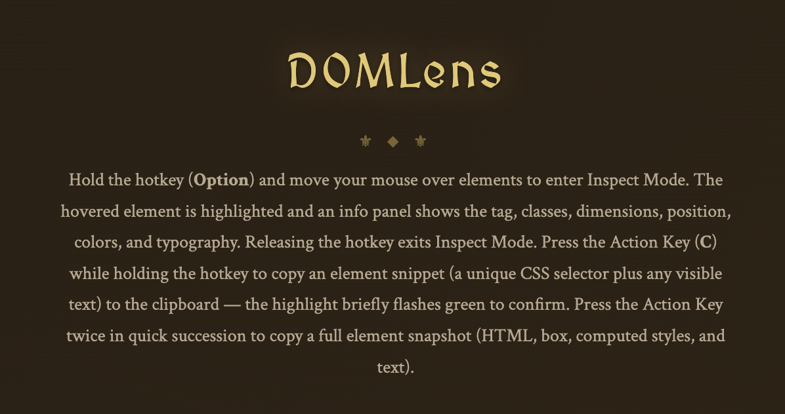

# DOMLens

> Hold a hotkey, hover any element, see what it's made of — and copy it in a format your AI agent can understand.


DOMLens is a **Chrome extension** for developers who work with AI agents. Hover an element, hit a key, and your clipboard gets either a clean HTML snippet or a full structured snapshot — perfect for handing to an LLM that needs to understand or rebuild a piece of UI.

It's **not** on the Chrome Web Store yet. You install it manually from this repository (see [Installation](#installation) below).

---

## Installation

DOMLens is currently distributed as an **unpacked extension**. You add it to Chrome yourself in three minutes:

1. **Download this repository** — click the green `Code` button on GitHub → `Download ZIP`, then unzip. (Or `git clone` if you prefer.)
2. **Open `chrome://extensions`** in Chrome.
3. **Enable Developer mode** (toggle in the top-right corner).
4. **Click `Load unpacked`** and select the unzipped `domlens/` folder.
5. **Pin DOMLens to the toolbar** by clicking the puzzle-piece icon and the pin next to DOMLens — this gives you one-click access to settings.

That's it. The extension works on every site immediately. Open the options page anytime by clicking the DOMLens toolbar icon.

> **Chrome Web Store:** _coming soon_ — for now, manual install is the only option.

---

## Features

### Hold-to-Inspect

Hold your hotkey (default: **Left Alt**) and move the mouse. A floating info panel follows your cursor and shows the hovered element's properties in real time. Release the key and everything disappears — no clutter, no devtools panel taking up half your screen.


### 20 Configurable Info Fields

The panel shows element properties grouped into four categories. Every field can be toggled on or off in the options page, so you only see what you care about.

| Group          | Fields                                                                |
| -------------- | --------------------------------------------------------------------- |
| **Box**        | Dimensions, Coordinates, Margin, Padding, Border, Border-radius       |
| **Layout**     | Display, Position, Z-index, Overflow, Opacity, Cursor                 |
| **Colors**     | Color (with swatch), Background (with swatch), Box-shadow             |
| **Typography** | Font, Size, Weight, Line-height, Letter-spacing, Text-align           |

Seven fields are enabled by default; the other thirteen are one click away.

### CSS Box Model Visualization

Four semi-transparent layers highlight the hovered element's box model:

- **Orange** — margin
- **Yellow** — border
- **Green** — padding
- **Blue** — content

Only non-zero layers are drawn, so a button with no margin only shows three of them. You instantly _see_ the spacing instead of mentally piecing it together from numbers.

### Copy to Clipboard — Tap or Hold

While holding the hotkey, press the **action key** (default: **C**) to copy. The action key has two modes depending on how long you press it:

**Tap → Element Snippet** (compact, one-line HTML)

```html
<button data-testid="submit-btn" class="btn-primary">Submit form</button>
```

Use this when you want to **quickly reference an element** — in a Slack message, a bug report, or a quick prompt to your AI. DOMLens strips utility classes (Tailwind, CSS modules, Emotion hashes) and keeps only the attributes that actually identify the element: `id`, `data-testid`, `aria-label`, `role`, and so on.

**Hold (300 ms) → Element Snapshot** (full structured JSON)

A progress indicator on the info panel fills while you hold; when it completes, the snapshot is captured. Release before 300 ms and you get the snippet instead. Pressing `Esc`, releasing the hotkey, or switching tabs cancels the hold.

```json
{
  "selector": "div.card > button#submit-btn",
  "box": { "width": 120, "height": 40, "x": 300, "y": 200 },
  "outerHTML": "<button id=\"submit-btn\" ...>Submit form</button>",
  "computedStyles": { "background-color": "rgb(59, 130, 246)", "...": "..." },
  "assets": { "fonts": ["..."], "images": ["..."], "cssVariables": { "...": "..." } },
  "screenshot": "data:image/png;base64,iVBORw0K..."
}
```

Use this when you want an **AI agent to rebuild or reason about the element** — selector, full HTML, computed styles (including descendants and `::before`/`::after`), referenced fonts and images, CSS custom properties, and a base64 screenshot of the rendered element. Drop the whole JSON into your prompt and the model has everything it needs.

---

## Quickstart

1. Install the extension (see above) and pin it to the toolbar.
2. Click the DOMLens icon to open the **options page**.
3. (Optional) Change the hotkey or action key, toggle the info fields you want.
4. Visit any webpage. **Hold the hotkey** and hover an element.
5. **Press the action key once** for a snippet, **twice** for a snapshot. A green toast confirms what was copied.

---

## Options Page



Click the DOMLens toolbar icon to open the options page. You can:

- **Set the hotkey** — click the recorder, press the key you want (Left Alt, Ctrl, Cmd, Shift, or any letter/number)
- **Set the action key** — same interaction, this is the key you tap while holding the hotkey
- **Toggle info fields** — checkboxes grouped by category, saved instantly
- **Reset to defaults** — one click restores the original setup

Settings sync across your Chrome profile via `chrome.storage.sync`.

---

## For Contributors

DOMLens is **zero-dependency vanilla JavaScript** — no npm, no bundler, no build step for development. Edit a file, reload the extension on `chrome://extensions`, done.

To package a release zip for the Chrome Web Store:

```bash
./build.sh
```

This produces `domlens.zip` containing only the runtime files.

---

## License

MIT — see [LICENSE](LICENSE).
